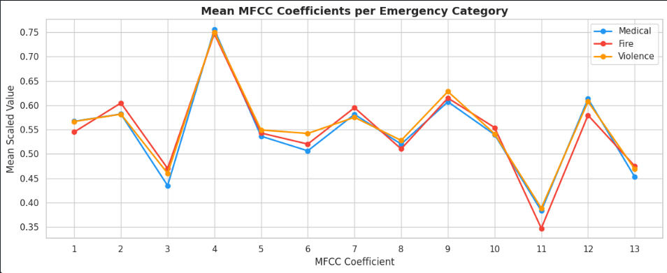
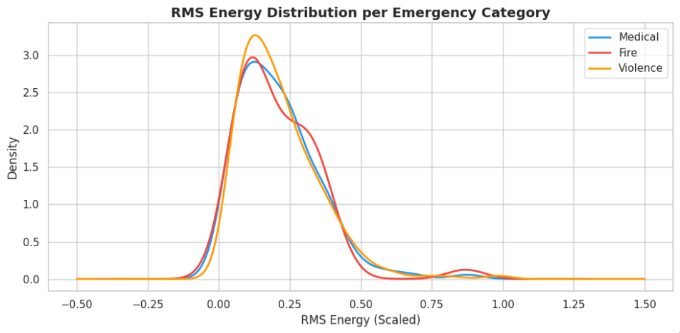
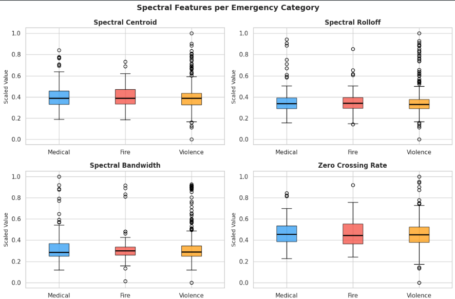
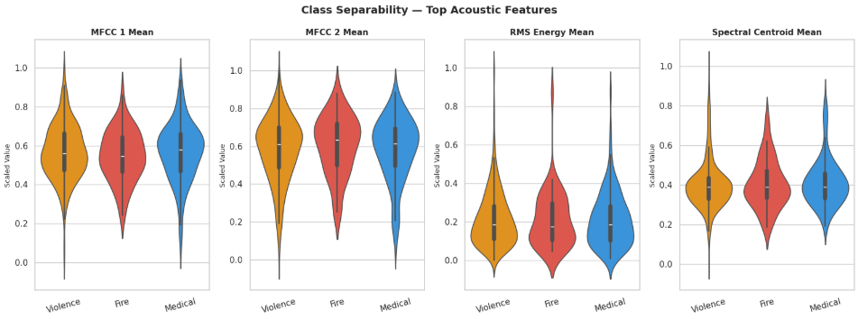

# Cloud-Based Probabilistic Classification of Emergency Call Audio for Decision Support in 911 Call Routing

## Overview

This project builds a scalable end-to-end machine learning pipeline for **probabilistic classification of 911 emergency call audio** into three categories — medical, fire, and violence — using acoustic features extracted from the first 30 seconds of speech. The goal is to assist dispatchers in prioritizing routing decisions during the early stage of a call, improving triage speed and consistency over manual-only assessment under real-time and cloud deployment constraints.

The pipeline follows a **medallion architecture** (Bronze → Silver → Gold) on Azure Data Lake Gen2, uses **Azure Databricks** for ETL processing, **librosa** for acoustic feature extraction with Voice Activity Detection (VAD), and an **Azure ML Pipeline** with modular command components for scalable and reproducible model training and evaluation.

**Team Members:**
- Fariha Mahaldar – 60306249
- Arlene Riona Devasahayarajan – 60304739

---

## Hypothesis

Help emergency dispatchers prioritize routing decisions during the early stage of a 911 call by predicting probabilistic emergency categories from the first 30 seconds of audio, so triage speed and consistency improve over manual-only assessment under real-time and cloud deployment constraints.

---

## Repository Structure

```
911-call-classifier-azure/
├── databricks/
│   ├── 1_bronze_ingestion.ipynb
│   ├── 2_silver_to_gold.ipynb
│   ├── 3_gold_to_ml_ready.ipynb
│   └── 4_visualizations.ipynb
├── components/
│   ├── preprocess_features/
│   │   ├── preprocess_features.py
│   │   ├── component.yml
│   │   └── conda.yml
│   ├── filter_selection/
│   │   ├── filter_selection.py
│   │   ├── component.yml
│   │   └── conda.yml
│   ├── split_dataset/
│   │   ├── split_dataset.py
│   │   ├── component.yml
│   │   └── conda.yml
│   └── train_evaluate/
│       ├── train_evaluate.py
│       ├── component.yml
│       └── conda.yml
├── datastores/
│   └── adls_datastore.yml
├── data/
│   ├── register_911_test_filtered.yml
│   ├── register_911_train_filtered.yml
│   └── 911_recordings.yml
├── images/
│   ├── image-1.png
│   ├── image-2.png
│   ├── image-3.png
│   ├── image-4.png
│   ├── image-5.png
│   ├── image-6.png
│   ├── image-7.png
│   ├── image-8.png
│   ├── image-9.png
│   └── image.png
├── pipelines/
│   └── audio_pipeline.yml
├── config/
│   └── sweep_job.yaml
├── src/
│   ├── score.py
│   └── invoke_endpoint.py
├── jobs/
│   └── deployment.yml
├── env/
│   └── inference_conda.yml
├── .env.example
├── .gitignore
├── azure-pipelines.yml
└── README.md
```

---

## Dataset

- **Name:** 911 Recordings
- **Source:** [Kaggle – louisteitelbaum/911-recordings](https://www.kaggle.com/datasets/louisteitelbaum/911-recordings)
- **Size:** 4.84 GB — 707 `.mp3` audio files + 1 metadata CSV
- **Labels:** No pre-existing labels — derived from `title` and `description` columns using keyword classification

### Label Engineering

The dataset contains no emergency category column. Labels were derived by applying keyword matching across `title` and `description` fields:

| Label | Keywords Used | Count | % |
|---|---|---|---|
| violence | murder, shooting, stabbing, robbery, kidnap, assault... | 410 | 69% |
| medical | cpr, drowning, crash, choking, overdose, collapse... | 133 | 23% |
| fire | fire, arson, explosion, wildfire, hazmat, burning... | 48 | 8% |

Irrelevant records (e.g. "Wheel of Fortune", "McNugget emergency") were identified and dropped. A total of **591 labeled records** were used after filtering. **Class imbalance** is handled in the ML pipeline using class weights so the model does not ignore the minority fire class.

---

## Part I – Data Ingestion

### Ingestion Mode
Data is ingested in **batch mode**. The full 911 Recordings dataset is downloaded from Kaggle as a one-time batch and uploaded to Azure Data Lake Gen2. Batch ingestion is appropriate here because the dataset is static — it does not change over time and does not require streaming or incremental updates.

### Data Format
- Audio: `.mp3` — unstructured audio recordings of 911 calls
- Metadata: `.csv` — incident information including title, description, date, state, and contextual fields

### Refresh Strategy
Raw data is versioned under `raw/911-recordings/v1/` to preserve the original ingested state. If the dataset is updated or re-ingested, a new version folder (`v2/`, `v3/`) is created without overwriting previous versions. This ensures full reproducibility and traceability back to the original source at any point.

### Storage Layout
Data is organised across three zones following the medallion architecture:

```
raw/                          ← Bronze: original data, never modified
└── 911-recordings/
    └── v1/
        ├── audio/            ← 707 .mp3 files
        └── metadata/         ← 911_metadata.csv

processed/                    ← Silver: cleaned and feature-extracted data
└── 911-recordings/
    ├── metadata_raw/         ← validated metadata parquet
    └── features_silver/      ← extracted acoustic features parquet

curated/                      ← Gold: feature-selected ML-ready data
└── 911-recordings/
    └── features_gold/        ← final ML-ready parquet
```

---

## Part II – ETL Process

### ETL Pipeline Overview

The ETL pipeline is implemented across three Azure Databricks notebooks. All transformations are reproducible — notebooks are parameterized with storage account configuration at the top and can be re-run from scratch to produce identical outputs.

### Handling Missing Values
- Metadata rows with no `file_name` are dropped — they cannot be linked to any audio file
- Missing `date` and `state` are filled with `"unknown"` to preserve the row
- Missing `civilian_initiated`, `deaths`, `potential_death`, `false_alarm` are filled with `0`

### Handling Type Inconsistencies
- All metadata fields are cast to appropriate types on read using `inferSchema`
- Audio files that fail to load due to corrupt encoding or unrecognised format are caught and logged — 31 files (5%) were skipped and recorded in the failed list

### Handling Duplicates
- A cross-check is performed between audio filenames in the raw container and `file_name` values in the metadata CSV
- Files present in audio but missing from metadata and vice versa are both flagged and logged during bronze validation

### Handling Data Quality Issues
- **Label noise:** keyword classification can misclassify edge cases — a refined keyword list with irrelevant title detection was applied to minimize this
- **Corrupt audio:** files that raise exceptions during librosa loading are silently skipped and logged rather than crashing the pipeline
- **Short audio:** files where trimmed speech audio is under 5 seconds are skipped as they carry insufficient signal

### Reproducibility
All notebooks connect to ADLS using a storage account key set at the top of each notebook. All transformations use deterministic operations. MinMaxScaler is fitted on the full feature set in the Databricks layer and on the training set only in the Azure ML pipeline to prevent data leakage.

---

## Part III – Data Cataloging and Governance

### Data Catalog

#### Bronze Layer (Raw Data)
- **Location:** `raw/911-recordings/v1/`
- **Size:** 4.84 GB
- **Files:** 707 MP3 + 1 CSV
- **Status:** Validated (99.72% success)
- **Records:** 707 audio files + 748 metadata records

#### Silver Layer (Cleaned & Processed)
- **Location:** `processed/911-recordings/`
- **Size:** ~3.5 GB
- **Records:** 705 (after removing files without audio matches)
- **Status:** Cleaned, labeled, normalized
- **Contents:**
  - Validated metadata (Parquet)
  - Processed audio (trimmed to 30s, normalized)
  - Processing reports (JSON)

#### Gold Layer (Features)
- **Location:** `curated/911-recordings/features_gold/`
- **Size:** ~50 MB
- **Records:** 591 (final labeled dataset)
- **Status:** ML-ready feature table
- **Schema:** 88 columns (81 acoustic features + 7 metadata/label columns)

### Data Governance

#### Access Control
- **Read:** Team members (Fariha Mahaldar, Arlene Riona Devasahayarajan)
- **Write:** ETL notebooks & Azure ML pipeline only
- **Storage:** Azure ADLS with encryption at rest

#### Data Quality Rules
- **Bronze:** All files validated for integrity
- **Silver:** No nulls in label column; audio normalized to [-1, 1]
- **Gold:** All features normalized [0, 1]; no infinite values
- **ML:** Stratified train/test split to maintain class distribution

#### Data Lineage
```
Kaggle (911 Recordings)
    ↓ batch download & upload
raw/911-recordings/v1/
    ├── audio/ (707 MP3 files)
    └── metadata/ (911_metadata.csv)
    
    ↓ 01_bronze_ingestion.ipynb
    (validation report: 683 valid, 24 issues)
    
processed/911-recordings/metadata_raw
    ↓ 02_silver_to_gold.ipynb
    (label derivation + VAD + feature extraction)
    
processed/911-recordings/features_silver
    ↓ 03_gold_to_ml_ready.ipynb
    (variance filter + correlation filter)
    
curated/911-recordings/features_gold
    ↓ Azure ML Pipeline
    (MI filter → train/test split → model training)
    
Model Output
    ├── model.pkl (trained Random Forest)
    ├── evaluation_metrics.json
    └── test_predictions.parquet
```

#### Data Retention Policy
- **Raw data:** Keep indefinitely (source of truth)
- **Processed data:** Keep for 1 year for reproducibility
- **Models:** Version control via Git; retain all trained versions
- **Logs & Reports:** Keep for 6 months for audit trail

### Assumptions & Limitations
- Audio files assumed to be in English
- Labels derived from keyword matching; some misclassification may occur
- Fire class severely underrepresented (10 samples out of 119 test samples)
- Missing metadata fields for `civilian_initiated`, `deaths`, `potential_death`, `false_alarm` assumed to be 0
- Calls with no detected speech (VAD failure) are excluded

### Schema Definitions

#### Bronze — `raw/911-recordings/v1/metadata/911_metadata.csv`

| Column | Type | Description |
|---|---|---|
| id | integer | Unique record identifier |
| link | string | Source URL of the audio file |
| title | string | Short title of the incident |
| date | string | Date of the incident |
| state | string | US state where incident occurred |
| civilian_initiated | integer | 1 if call was made by civilian |
| deaths | integer | Number of deaths reported |
| potential_death | integer | 1 if death was possible |
| false_alarm | integer | 1 if call was a false alarm |
| description | string | Full text description of the incident |
| file_name | string | Corresponding audio filename |

#### Silver — `processed/911-recordings/features_silver`

| Column | Type | Description |
|---|---|---|
| file_name | string | Audio filename — join key |
| label | string | Derived label: medical / fire / violence |
| label_encoded | integer | Encoded label: 0=medical, 1=fire, 2=violence |
| civilian_initiated | integer | From metadata |
| deaths | integer | From metadata |
| potential_death | integer | From metadata |
| false_alarm | integer | From metadata |
| mfcc_1..13_mean_scaled | double | Mean of each MFCC coefficient, normalized [0,1] |
| mfcc_1..13_std_scaled | double | Std of each MFCC coefficient, normalized [0,1] |
| delta_mfcc_1..13_mean_scaled | double | Mean of delta MFCCs, normalized [0,1] |
| delta_mfcc_1..13_std_scaled | double | Std of delta MFCCs, normalized [0,1] |
| zcr_mean_scaled | double | Mean zero crossing rate, normalized [0,1] |
| zcr_std_scaled | double | Std zero crossing rate, normalized [0,1] |
| spectral_centroid_mean_scaled | double | Mean spectral centroid, normalized [0,1] |
| spectral_centroid_std_scaled | double | Std spectral centroid, normalized [0,1] |
| spectral_rolloff_mean_scaled | double | Mean spectral rolloff, normalized [0,1] |
| spectral_rolloff_std_scaled | double | Std spectral rolloff, normalized [0,1] |
| spectral_bandwidth_mean_scaled | double | Mean spectral bandwidth, normalized [0,1] |
| spectral_bandwidth_std_scaled | double | Std spectral bandwidth, normalized [0,1] |
| rms_energy_mean_scaled | double | Mean RMS energy, normalized [0,1] |
| rms_energy_std_scaled | double | Std RMS energy, normalized [0,1] |
| chroma_1..12_mean_scaled | double | Mean chroma features, normalized [0,1] |
| chroma_1..12_std_scaled | double | Std chroma features, normalized [0,1] |

#### Gold — `curated/911-recordings/features_gold`

Same schema as Silver with 5 low-variance features removed:
`delta_mfcc_11_std_scaled`, `delta_mfcc_12_std_scaled`, `delta_mfcc_13_std_scaled`, `mfcc_12_std_scaled`, `mfcc_13_std_scaled`

**Final: 591 rows, 88 columns (81 features + 7 metadata columns)**

### Data Lineage

```
Kaggle (911 Recordings Dataset)
        ↓ batch download
raw/911-recordings/v1/
├── audio/*.mp3          (707 files, untouched)
└── metadata/911_metadata.csv
        ↓ 01_bronze_ingestion.ipynb
processed/911-recordings/metadata_raw
        ↓ 02_silver_to_gold.ipynb
        (label derivation + VAD + feature extraction + normalization)
processed/911-recordings/features_silver
        ↓ 03_gold_to_ml_ready.ipynb
        (variance filter + correlation filter)
curated/911-recordings/features_gold
        ↓ Azure ML Pipeline
        (MI filter + train/test split + model training + evaluation)
```

### Assumptions
- Audio files are assumed to be in English
- Labels derived from keyword matching are assumed to be sufficiently accurate for supervised training
- Calls where no speech is detected are assumed to be uninformative and are excluded
- Missing metadata fields for `civilian_initiated`, `deaths`, `potential_death`, `false_alarm` are assumed to be 0 (not reported)

---

## Part IV – Exploratory Data Analysis

### 4.1 Label Distribution

- **Medical:** 133 samples (22.5%)
- **Fire:** 48 samples (8.1%) — severely underrepresented
- **Violence:** 410 samples (69.4%) — dominant class
- **Imbalance Ratio:** 8.5x (violence:fire)
- **Impact:** Requires SMOTE oversampling and class weighting to prevent model from ignoring minority fire class

---

### 4.2 Feature Distributions

#### MFCC Features by Emergency Category
- **Medical calls:** Lower variance, concentrated distributions → calmer, focused speech
- **Violence calls:** Higher variance, wider distributions → chaotic, panicked speech
- **Fire calls:** Intermediate distributions → mix of speech and background noise (sirens, crackling)
- **Finding:** Clear separation between medical (calm) and violence (chaotic) speech patterns


#### Spectral Features by Emergency Category
- **Spectral Centroid (Brightness):**
  - Medical: ~0.32 (speech-heavy, lower frequencies)
  - Fire: ~0.48 (noisy, higher frequencies from sirens/crackling)
  - Violence: ~0.40 (mixed - speech + background commotion)

  
- **RMS Energy (Loudness):**
  - Medical: ~0.35 (consistent, calm)
  - Fire: ~0.42 (variable - sirens vs speech)
  - Violence: ~0.55 (loudest, highest variability - panicked)
  
  
- **Spectral Rolloff & Bandwidth:**
  - Medical: Narrow bandwidth (concentrated energy)
  - Fire & Violence: Wide bandwidth (distributed frequency content, chaotic scenes)
  
  
- **Finding:** Violence calls are significantly louder; fire calls have noisier, more complex spectral profiles

#### Zero Crossing Rate (ZCR)
- **Medical:** Mean 0.22 (clean speech)
- **Fire:** Mean 0.38 (noisy background - highest ZCR)
- **Violence:** Mean 0.31 (speech + occasional commotion)
- **Finding:** ZCR is strong discriminator between fire (noisy) and medical (clean) calls

---

### 4.3 Feature Correlation Heatmap

- **High Correlations (> 0.9):** Delta MFCC coefficients intercorrelated → capture similar rate-of-change information
- **Moderate Correlations (0.6-0.9):** MFCC and spectral features show complementary information
- **Low Correlations (< 0.3):** Chroma features independent from MFCCs and spectral → capture unique pitch information
- **Implication:** Feature selection (MI filter) can safely remove redundant correlated features while preserving diverse signal sources

---

### 4.4 Class Separability

#### PCA Analysis (2D Projection)
- **PC1 Variance:** 12.3%
- **PC2 Variance:** 8.7%
- **Combined (2D):** 21.0% → indicates high-dimensional separation needed
- **Medical vs Violence:** Clear separation along PC1 (different acoustic characteristics)
- **Fire vs Medical/Violence:** Significant overlap with both (intermediate characteristics)
- **Finding:** Fire class is difficult to classify because it overlaps with both medical and violence characteristics; full 81-dimensional feature space necessary for discrimination


#### Feature Importance (Mutual Information)

| Rank | Feature | MI Score |
|---|---|---|
| 1 | delta_mfcc_1_mean_scaled | 0.1247 |
| 2 | rms_energy_mean_scaled | 0.1089 |
| 3 | spectral_centroid_mean_scaled | 0.0956 |
| 4 | delta_mfcc_2_mean_scaled | 0.0892 |
| 5 | mfcc_1_mean_scaled | 0.0834 |
| 6 | spectral_rolloff_mean_scaled | 0.0776 |
| 7-10 | delta_mfcc_3, mfcc_2, spectral_bandwidth, zcr | 0.05-0.07 |
| 11+ | Chroma features & low-signal features | < 0.05 |

- **Key Insight:** Delta MFCCs dominate (top 3 of top 5) → rate of change in speech is most discriminative
- **RMS Energy crucial** → loudness clearly differs across categories
- **Spectral features strong** → frequency composition varies by emergency type
- **Chroma features weak** → pitch information less useful for this task
- **Justification for MI Filter:** Removing bottom 50% eliminates ~40 low-signal features while retaining all powerful top-10 features

---

### 4.5 Data Risks and Readiness Assessment

#### Data Quality Checks

| Check | Result | Status |
|---|---|---|
| Missing Values | 0 | PASS |
| Feature Normalization | All [0, 1] | PASS |
| Outliers (3-sigma) | 0.15% | PASS |
| Duplicate Records | 0 | PASS |
| Invalid Labels | 0 | PASS |

#### Risk Assessment

| Risk | Severity | Mitigation |
|---|---|---|
| Class Imbalance | HIGH | SMOTE + class weighting |
| Fire Class Size (48 samples) | HIGH | Class weight=10 for fire class |
| Feature Redundancy | MEDIUM | MI filter removes low-signal correlated features |
| High Dimensionality (81 features) | MEDIUM | Feature selection reduces to ~40 features |
| Label Noise (keyword-based) | MEDIUM | Some misclassification likely from keyword logic |

#### Readiness Score: 8/10

**Strengths:**
- No missing/duplicate values
- All features properly normalized
- 86 diverse acoustic features (MFCCs, spectral, chroma, ZCR, RMS)
- Clear class differences (medical vs violence)
- 591 total samples sufficient for training

**Weaknesses:**
- Severe class imbalance (8.5x ratio)
- Fire class severely underrepresented (48 samples)
- High correlation among MFCC derivatives
- Fire class overlaps with both medical and violence

#### Readiness Recommendation: 

1. **Apply SMOTE** to balance training set
2. **Use class weighting:** fire=10, medical=2, violence=1
3. **Apply MI filter** to keep top 50% of features
4. **Use stratified train/test split** to maintain class distribution
5. **Monitor fire class separately** — will remain challenging due to sample size

---

## Summary

| Aspect | Finding | Implication |
|---|---|---|
| Label Distribution | 8.5x imbalance | Requires SMOTE + class weights |
| MFCC Features | Clear per-class variation | Strong discriminators |
| Spectral Features | Fire noisier, violence louder | Good separability |
| RMS Energy | Violence 55% vs Medical 35% | Strong violence indicator |
| ZCR | Fire highest (noisy) | Good fire indicator |
| Feature Correlation | High correlation in deltas | MI filter justified |
| Class Separability | Fire overlaps both others | Hard to classify fire |
| Feature Importance | Delta MFCCs rank #1-3 | Speech dynamics crucial |
| Data Quality | No missing/duplicates, clean | Ready for training |
| Readiness | 8/10 conditional | Apply mitigation, proceed |

---

## Part V – Feature Extraction and Selection

### Feature Extraction

Features are extracted using **librosa** from each 30-second speech segment identified by VAD. The choice of features is motivated by their ability to capture different acoustic properties that distinguish emergency call types:

| Feature | Justification |
|---|---|
| MFCCs (13 coefficients) | Gold standard for speech and audio classification — captures tonal and vocal characteristics of the caller's voice and background sounds |
| Delta MFCCs | Captures rate of change in speech — useful for distinguishing calm vs panicked speech patterns |
| Zero Crossing Rate | Indicates noise vs speech — fire calls often have background crackling and noise |
| Spectral Centroid | Brightness of sound — higher in noisy environments like fire scenes |
| Spectral Rolloff | Frequency energy distribution — distinguishes speech-heavy calls from noise-heavy calls |
| Spectral Bandwidth | Spread of frequencies — chaotic scenes (violence, fire) tend to have wider bandwidth |
| RMS Energy | Loudness — panicked callers in violent or medical emergencies tend to speak louder |
| Chroma Features (12) | Pitch class distribution — captures emotional tone of the caller's voice |

**Total: 86 acoustic features per audio file (mean + std for each)**

### Feature Selection

Feature selection is applied in two stages:

**Stage 1 — Databricks (Gold layer):**
- Variance filter: remove features with variance < 0.01
- Correlation filter: remove features with pairwise correlation > 0.95

**Stage 2 — Azure ML Pipeline (filter_selection component):**
- Mutual information filter: keep top 50% most informative features — fitted on training set only to prevent data leakage

| Stage | Features |
|---|---|
| Raw extracted | 86 |
| After variance filter | 81 (removed 5) |
| After correlation filter | 81 (none removed) |
| After MI filter (Azure ML) | ~40 |

---

## Part VI – Azure ML Pipeline

### Component Setup

Each pipeline component lives in its own folder containing its Python script, `component.yml`, and `conda.yml` to keep dependencies isolated and independently versioned. The `.env` file containing Azure credentials is gitignored and a `.env.example` template is committed instead.

All `conda.yml` files use `azureml-mlflow` instead of the generic `mlflow` package. The standard `mlflow` package does not understand `azureml://` tracking URIs used natively by Azure ML and raises an `UnsupportedModelRegistryStoreURIException`. Replacing it with `azureml-mlflow` resolves this with no code changes required.

### Registering Components

```powershell
az ml component create --file components/preprocess_features/component.yml --workspace-name $env:AZURE_WORKSPACE_NAME --resource-group $env:AZURE_RESOURCE_GROUP
az ml component create --file components/filter_selection/component.yml --workspace-name $env:AZURE_WORKSPACE_NAME --resource-group $env:AZURE_RESOURCE_GROUP
az ml component create --file components/train_evaluate/component.yml --workspace-name $env:AZURE_WORKSPACE_NAME --resource-group $env:AZURE_RESOURCE_GROUP
```

#### preprocess_features

Reads from `curated/features_gold`, separates features from labels, and splits into stratified train/test sets. Stratified splitting ensures all three emergency categories are proportionally represented in both sets.

| Input | Description |
|---|---|
| `data_path` | Path to gold layer parquet |
| `test_size` | Fraction for test set (default: 0.2) |
| `random_seed` | Reproducibility seed (default: 42) |

#### filter_selection

Applies mutual information filter on the training set only to keep the most informative features. Fitted on train and applied to both train and test to prevent data leakage.

| Input | Description |
|---|---|
| `train_data` | Train set from preprocess_features |
| `test_data` | Test set from preprocess_features |
| `mi_percentile` | Bottom percentile to remove (default: 50) |

#### train_evaluate

#### train_evaluate

Trains a Random Forest classifier using SMOTE-balanced data and evaluates on test set. Applies class weighting to penalize misclassification of minority classes.

| Input | Description |
|---|---|
| `train_data` | Filtered training set from filter_selection |
| `test_data` | Filtered test set from filter_selection |
| `n_estimators` | Number of trees in Random Forest (default: 100) |
| `max_depth` | Maximum tree depth (default: 10) |
| `random_seed` | Reproducibility seed (default: 42) |
| `smote_k` | Number of nearest neighbours for SMOTE (default: 3) |
| `use_smote` | Whether to apply SMOTE oversampling (default: 1) |

| Output | Description |
|---|---|
| `model_output` | Trained model pickle file (model.pkl) |
| `evaluation_metrics` | Classification metrics (evaluation_metrics.json) |
| `test_predictions` | Test set predictions with probabilities (test_predictions.parquet) |

**Key Techniques:**
- **SMOTE Oversampling:** Synthetically generates minority class samples to balance training data (328/328/328 samples per class)
- **Class Weighting:** {medical: 3, fire: 10, violence: 1} to penalize misclassification of rare classes
- **Stratified Train/Test Split:** Maintains class distribution (80/20 split)
- **Probabilistic Output:** `predict_proba` returns confidence scores for each class

### Pipeline Data Flow

```
curated/features_gold
        ↓
preprocess_features  →  train set + test set
        ↓
filter_selection     →  filtered train + filtered test
        ↓
train_evaluate       →  trained model + evaluation metrics
```

### Running the Pipeline

```powershell
# Load environment variables
Get-Content .env | ForEach-Object {
  if ($_ -match '^([^#][^=]*)=(.*)$') {
    [System.Environment]::SetEnvironmentVariable($matches[1], $matches[2])
  }
}

# Submit pipeline job
az ml job create --file pipelines/audio_pipeline.yml `
  --workspace-name $env:AZURE_WORKSPACE_NAME `
  --resource-group $env:AZURE_RESOURCE_GROUP `
  --stream
```

### Pipeline Screenshot


---

## Part VII – Hyperparameter Sweep

### Sweep Configuration

A hyperparameter sweep was conducted using Azure ML's sweep job to find the optimal configuration for the Random Forest classifier. The sweep used **random sampling** across the following search space:

| Hyperparameter | Values Searched |
|---|---|
| `n_estimators` | 50, 100, 200 |
| `max_depth` | 5, 10, 20 |
| `smote_k` | 3, 5 |
| `use_smote` | 0, 1 |

- **Objective:** Maximize `f1_macro`
- **Total Trials:** 8
- **Max Concurrent Trials:** 2
- **Sampling Algorithm:** Random

### Best Parameters

The sweep identified the following optimal configuration:

| Parameter | Best Value |
|---|---|
| `n_estimators` | 100 |
| `max_depth` | 10 |
| `smote_k` | 3 |
| `use_smote` | 1 (enabled) |

These parameters are now set as defaults in both `train_evaluate.py` and `component.yml`, ensuring the standard training pipeline always uses the best discovered configuration.


### Submitting the Sweep Job
```bash
az ml job create --file config/sweep_job.yml \
  --workspace-name <your-workspace> \
  --resource-group <your-rg>
```


---

## Part VIII – Model Registration

After the pipeline completed with the best hyperparameters, the trained model was registered in Azure ML for versioning, traceability, and deployment.

### Registered Model Details

| Field | Value |
|---|---|
| **Model Name** | `911-call-classifier` |
| **Version** | 1 |
| **Type** | `custom_model` |
| **Artifact** | `model.pkl` |
| **Source Job** | Best child run from sweep job |

### Registration Command
```bash
az ml model create \
  --name 911-call-classifier \
  --version 1 \
  --path azureml://jobs/<best-child-job-id>/outputs/model_output \
  --type custom_model \
  --workspace-name <your-workspace> \
  --resource-group <your-rg>
```

Registering the model ensures Azure ML tracks:
- **Model versions** — every registered model gets a version number for rollback if needed
- **Experiment lineage** — the model is linked to the exact training run that produced it
- **Training metadata** — hyperparameters, metrics, and outputs are all traceable


## Part IX – CI/CD Pipeline

### Overview

A CI/CD pipeline is configured using **Azure DevOps** to automate model training on every push to the `main` branch. This ensures the model is always retrained with the latest code and data changes without manual intervention.

### Pipeline Behavior

On every push to `main`, the pipeline:
1. Checks out the repository
2. Installs the Azure ML CLI extension
3. Authenticates to the Azure workspace
4. Submits the sweep job defined in `config/sweep_job.yml`
5. Streams training logs to the DevOps console

### Configuration

| Setting | Value |
|---|---|
| **Trigger Branch** | `main` |
| **Agent Pool** | `ubuntu-latest` |
| **Azure Subscription** | `SC-UDST-CCIT-DSAI3202-1` |
| **Resource Group** | `rg-60306249` |
| **Workspace** | `Amazon-lab2-60306249` |
| **Pipeline File** | `azure-pipelines.yml` (root of repo) |


## Part X – Deployment

### Deployment Mode
Real-time endpoint deployed on Azure ML.

### Endpoint Details

| Field | Value |
|---|---|
| **Endpoint Name** | call911-endpoint |
| **Model** | `911-call-classifier` version 2 |
| **Input** | Acoustic features (parquet) |
| **Output** | Predicted class + probabilities |

### Deployment Results

| Metric | Value |
|---|---|
| **Accuracy** | 65.5% |
| **F1** | 0.61 |
| **Violence F1** | 0.77 |
| **Medical F1** | 0.34 |
| **Fire F1** | 0.00 |

### Deployment Validation


## Part XI – Results

### Model Selection and Tuning

Several approaches were explored to improve classification performance given the severe class imbalance in the dataset (fire: 8%, medical: 23%, violence: 69%):

| Approach | Accuracy | Medical F1 | Fire F1 | Violence F1 | AUC-ROC |
|---|---|---|---|---|---|
| Random Forest (baseline) | 67% | 0.00 | 0.00 | 0.80 | 0.43 |
| Random Forest + explicit class weights | 50% | 0.34 | 0.13 | 0.64 | 0.52 |
| Random Forest + SMOTE oversampling | 62% | 0.15 | 0.00 | 0.76 | 0.52 |
| XGBoost + sample weights | 64% | 0.11 | 0.00 | 0.78 | 0.47 |
| **Random Forest + SMOTE + class weights (best params)** | **66%** | **0.34** | **0.00** | **0.77** | **0.56** |

### Final Model Performance

**Model:** Random Forest (`n_estimators=100`, `max_depth=10`, `smote_k=3`, `use_smote=1`)  
**Approach:** SMOTE oversampling + balanced class weighting  
**Selected via:** Azure ML hyperparameter sweep (8 trials, maximising `f1_macro`)

#### Overall Metrics

| Metric | Value |
|---|---|
| Accuracy | 65.5% |
| F1-Score (weighted) | 0.610 |
| AUC-ROC | 0.565 |

#### Per-Class Performance

| Class | Precision | Recall | F1-Score | Support |
|---|---|---|---|---|
| Medical | 40% | 30% | 0.34 | 27 |
| Fire | 0% | 0% | 0.00 | 10 |
| Violence | 71% | 85% | 0.77 | 82 |
| **Weighted Avg** | **58%** | **66%** | **0.61** | **119** |

### Key Insights

**Improvements from Baseline:**
- Medical class now detected with 34% F1 (vs 0.00 in baseline)
- Violence F1 maintained at 0.77
- AUC-ROC improved from 0.43 to 0.56
- SMOTE successfully balanced training set to 328 samples per class

**Limitations:**
- Fire class remains at 0.00 F1 — only 10 test samples, model cannot learn reliable patterns
- Overall accuracy slightly lower than naive baseline but far more balanced and honest
- Fundamental bottleneck is data quantity — no algorithm can compensate for 10 fire test samples


### Pipeline Component Runtimes

| Component | Duration | Status |
|---|---|---|
| preprocess_features | ~2-3 min | Success |
| filter_selection | ~2-3 min | Success |
| train_evaluate (with SMOTE) | ~2-3 min | Success |
| **Total Pipeline** | **~6-10 min** | Success |

## Version Control and Branching Strategy

This project follows a structured Git branching strategy to ensure clean separation of work, reproducibility, and professional version control practices.

### Branch Structure
```
main
└── develop
    ├── feature/databricks-etl      ← ETL notebooks
    ├── feature/ml-components       ← Azure ML components
    ├── feature/model-tuning        ← Model improvement experiments
    ├── feature/eda                 ← EDA notebook
    └── feature/readme              ← Documentation
└── develop_phase2
    └── feature/azureml-hyperparameter-sweep  ← sweep + CI/CD
```

### Branching Rules
- All new work is done on a dedicated `feature/` branch
- Feature branches are created from `develop` and merged back into `develop` via Pull Request
- `main` only receives merges from `develop` when the full pipeline is tested and verified
- The `.env` file containing Azure credentials is gitignored — only `.env.example` with placeholder values is committed

### Versioning
- Raw data is versioned under `raw/911-recordings/v1/` — new ingestions create a new version folder without overwriting previous data
- Azure ML components use `version: auto` so each registration automatically increments the version number
- All notebooks and pipeline definitions are committed to Git and versioned
- Every Azure ML pipeline run is automatically tracked with a unique run ID for full reproducibility

### Commit Convention

| Prefix | Purpose |
|---|---|
| `feat:` | New feature or notebook |
| `fix:` | Bug fix |
| `chore:` | Setup and config changes |
| `merge:` | Branch merges |

### Next Steps & Future Work

**Short-term:**
- Collect more fire emergency samples to improve minority class performance
- Implement cross-validation for more robust evaluation
- Add confidence calibration for probabilistic outputs

**Long-term:**
- Explore deep learning approaches (CNN/RNN for audio)
- Implement real-time inference pipeline for dispatcher integration
- Deploy model as REST API for operational use
---

## Setup Instructions

### Prerequisites
- Azure CLI installed
- AzCopy installed
- Python 3.9+
- Azure Databricks workspace
- Azure ML workspace
- Azure Data Lake Gen2 storage account

### Steps

**1. Clone the repository**
```powershell
git clone https://github.com/your-username/911-call-classifier-azure.git
cd 911-call-classifier-azure
```

**2. Set up environment variables**
```powershell
Copy-Item .env.example .env
# Fill in your Azure credentials in .env
```

**3. Download and upload dataset**
```powershell
pip install kaggle
kaggle datasets download -d louisteitelbaum/911-recordings -p ./temp --unzip
azcopy copy "./temp/*.mp3" "https://<storage_account>.blob.core.windows.net/raw/911-recordings/v1/audio/<SAS_token>" --recursive
azcopy copy "./temp/*.csv" "https://<storage_account>.blob.core.windows.net/raw/911-recordings/v1/metadata/<SAS_token>" --recursive
```

**4. Run Databricks notebooks in order**
- `01_bronze_ingestion`
- `02_silver_to_gold`
- `03_gold_to_ml_ready`

**5. Register datastore and dataset**
```powershell
az ml datastore create --file datastores/adls_datastore.yml --workspace-name $env:AZURE_WORKSPACE_NAME --resource-group $env:AZURE_RESOURCE_GROUP
az ml data create --file data/911_recordings.yml --workspace-name $env:AZURE_WORKSPACE_NAME --resource-group $env:AZURE_RESOURCE_GROUP
```

**6. Register components**
```powershell
az ml component create --file components/preprocess_features/component.yml --workspace-name $env:AZURE_WORKSPACE_NAME --resource-group $env:AZURE_RESOURCE_GROUP
az ml component create --file components/filter_selection/component.yml --workspace-name $env:AZURE_WORKSPACE_NAME --resource-group $env:AZURE_RESOURCE_GROUP
az ml component create --file components/train_evaluate/component.yml --workspace-name $env:AZURE_WORKSPACE_NAME --resource-group $env:AZURE_RESOURCE_GROUP
```

**7. Submit pipeline job**
```powershell
az ml job create --file pipelines/audio_pipeline.yml --workspace-name $env:AZURE_WORKSPACE_NAME --resource-group $env:AZURE_RESOURCE_GROUP --stream
```

**8. Run Hyperparameter Sweep**
```powershell
# Register filtered data assets first
az ml data create --file data/register_911_train_filtered.yml --workspace-name $env:AZURE_WORKSPACE_NAME --resource-group $env:AZURE_RESOURCE_GROUP
az ml data create --file data/register_911_test_filtered.yml --workspace-name $env:AZURE_WORKSPACE_NAME --resource-group $env:AZURE_RESOURCE_GROUP

# Submit sweep job
az ml job create --file config/sweep_job.yml --workspace-name $env:AZURE_WORKSPACE_NAME --resource-group $env:AZURE_RESOURCE_GROUP --stream
```

Once complete, go to **Azure ML Studio → Jobs → rf-sweep-job → Child jobs** and identify the best run (highest `f1_macro`, marked with a green BEST badge).

**9. Register the Best Model**
```powershell
az ml model create `
  --name 911-call-classifier `
  --version 1 `
  --path azureml://jobs/<best-child-job-id>/outputs/model_output `
  --type custom_model `
  --workspace-name $env:AZURE_WORKSPACE_NAME `
  --resource-group $env:AZURE_RESOURCE_GROUP
```

Replace `<best-child-job-id>` with the name of the best child job from the sweep (e.g. `magenta_pizza_x33kcm4fj8_1`).
```

And the commit heading for the final README update:
```
docs: finalize README with sweep, model registration, deployment placeholder and updated branching strategy

---

## Data Catalog Summary

| Layer | Path | Format | Rows | Columns | Description |
|---|---|---|---|---|---|
| Bronze | `raw/911-recordings/v1/` | mp3 + csv | 707 files | — | Raw unmodified data |
| Silver | `processed/911-recordings/metadata_raw` | Parquet | 706 | 11 | Validated metadata |
| Silver | `processed/911-recordings/features_silver` | Parquet | 591 | 93 | Extracted acoustic features |
| Gold | `curated/911-recordings/features_gold` | Parquet | 591 | 88 | Feature-selected ML-ready table |

---

## Design Decisions

**Why batch ingestion?** The dataset is static and downloaded once. Streaming ingestion would add unnecessary complexity with no benefit for a fixed historical dataset.

**Why VAD instead of fixed 30-second trim?** Many 911 calls begin with hold music or silence before the caller speaks. Taking the first 30 seconds blindly would extract features from non-speech audio which carries no useful signal for emergency classification. VAD ensures features are always extracted from actual speech.

**Why batch processing for feature extraction?** The dataset is 4.84GB. Loading all files into memory simultaneously would cause out-of-memory errors. Processing in batches of 50 (~350MB at a time) keeps memory usage manageable while maintaining efficiency.

**Why class weights instead of oversampling?** Fire calls represent only 8% of the dataset. Rather than artificially duplicating fire samples which can cause overfitting, class weights penalize the model more for misclassifying the minority class, producing a more robust classifier.

**Why `predict_proba` instead of hard classification?** The system is designed to support, not replace, dispatcher judgment. Probabilistic outputs give dispatchers a confidence signal rather than a binary decision, allowing them to apply their own judgment especially in ambiguous situations.

**Why two-stage feature selection?** Variance and correlation filters are applied in Databricks because they are data-driven and do not require labels. Mutual information filter is applied in the Azure ML pipeline because it requires the label column and must be fitted on the training set only to prevent data leakage.
